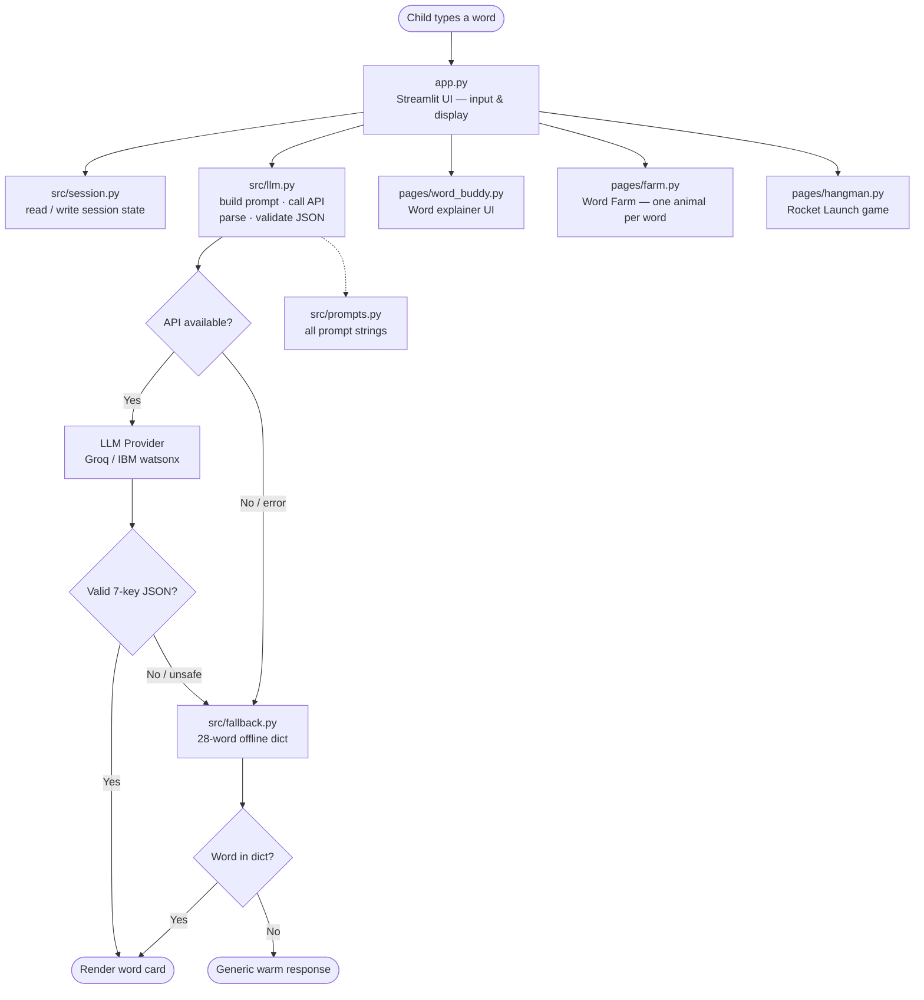

<<<<<<< HEAD
# 🌟 WordBuddy

> **One-sentence pitch:** WordBuddy is a kid-friendly AI companion that turns intimidating vocabulary words into clear, encouraging, bite-sized explanations — so children ages 8–10 feel confident enough to keep reading instead of giving up.

Built for the **IBM AI Builders Challenge — Wildcard: Future of Work** track.

---

## The Problem

Kids freeze on big words.

When a 9-year-old hits *"photosynthesis"* or *"circumstantial"* mid-sentence, the usual options are bad:

- Ask an adult who is busy → wait, lose the thread, give up
- Look it up in a dictionary → dry, long, uses more big words
- Guess and move on → meaning lost; comprehension suffers

The deeper issue is **shame**. Stopping to ask feels embarrassing. Admitting confusion feels like failure. Children who feel judged for not knowing a word stop asking altogether — and reading confidence collapses faster than the vocabulary gap can be closed.

---

## The Solution

WordBuddy is a safe, always-patient AI that a child can open at any moment and type any word they don't know. It responds with:

- **Syllable breaks** so the word feels less scary to pronounce
- **A pronunciation hint** using everyday sounds (no IPA)
- **A plain-English definition** written at 2nd–3rd grade reading level
- **Two example sentences** using the word in real contexts
- **An analogy** drawn from the child's world (food, toys, school, pets)
- **Encouragement** that names the achievement ("You just learned a HUGE word!")
- **A practice question** that earns bonus tokens — making re-use feel like a game

No shame. No judgment. No right or wrong answers. Just a calm, warm response every single time.

---

## Target Users

| Who | How they use WordBuddy |
|---|---|
| **Children 8–10** | Primary users — look up words independently while reading |
| **Parents** | Open the app alongside their child; use Word-of-the-Week prompts |
| **Teachers** | Project to the class; use the Rocket Launch game as a vocab review activity |

---

## Challenge Theme

**Wildcard — Future of Work**

Literacy is the foundation of every career. A child who falls behind in reading vocabulary at ages 8–10 faces compounding disadvantages in comprehension, writing, and ultimately employment. WordBuddy is a zero-cost intervention that equips children to build vocabulary independently, at their own pace, without requiring a specialist or a subscription.

---

## AI Approach and Architecture

### How the AI works

WordBuddy sends every looked-up word to a large language model with a tightly constrained system prompt. The prompt:

1. Locks output to a **7-key JSON schema** — the app never parses free text
2. Sets reading level to **2nd–3rd grade** throughout all fields
3. Forbids adult content, medical language, frightening examples, and shaming phrasing
4. Requires analogies drawn from a child's everyday experience
5. Ends every response with a named, specific word of encouragement

All LLM output is **validated** before it is shown to the child. If any key is missing, any string is too long, or any content matches the safety blocklist, the response is discarded and the offline fallback dictionary is used instead. The child never sees a raw error or a JSON fragment.

### Architecture



### Module boundaries (strictly enforced)

| Module | Responsibility | May NOT |
|---|---|---|
| `app.py` | Page config, navigation, shared sidebar | Contain business logic |
| `pages/word_buddy.py` | Word-explainer UI | Call LLM directly |
| `pages/farm.py` | Animal grid motivator | Access session state directly |
| `pages/hangman.py` | Rocket Launch game UI | Import from `src/llm.py` |
| `src/llm.py` | All LLM calls, JSON parsing, validation | Render UI, touch session state |
| `src/prompts.py` | Every prompt string | Contain logic |
| `src/fallback.py` | Offline word dictionary | Import Streamlit |
| `src/session.py` | All `st.session_state` reads/writes | Contain UI code |
| `src/farm.py` | Pure animal-assignment logic | Import Streamlit |
| `src/hangman.py` | Pure game logic (mask, win/lose) | Import Streamlit |

---

## How IBM Bob Was Used

WordBuddy was built **entirely inside Bob** — from blank repo to 156 passing tests — using all three modes deliberately and iteratively.

### Mode strategy

| Mode | When used |
|---|---|
| **Ask** | Understanding Streamlit constraints (`st.navigation`, rerun behaviour, session state lifecycle); clarifying how Bob tools work |
| **Plan** | Writing `docs/PLAN.md`; deciding module boundaries, JSON schema, fallback strategy, and safety rules before any code was written |
| **Agent** | All implementation: file creation, edits, test-writing, bug fixes, UX polish |

### `/init` and `AGENTS.md`

After planning, `/init` was used to generate the initial project context. The resulting `AGENTS.md` files (at root and in `.bob/rules-*/`) gave every subsequent Bob session the same grounding:

- Project purpose and target audience
- Module boundary rules (e.g. "all LLM calls stay in `src/llm.py`")
- Safety rules ("2nd–3rd grade reading level everywhere")
- What is out of scope for v1

This meant Bob never suggested adding a database, never reached across module boundaries, and never used adult vocabulary in generated content — across dozens of separate sessions.

### Example prompts used

```
[Plan mode]
"I want to build a kid-friendly vocab app for children ages 8-10.
 No database, Streamlit only, LLM output must be structured JSON.
 Help me write a complete PLAN.md before I write any code."

[Agent mode]
"Implement src/llm.py. It must never raise to callers.
 Use the schema in PLAN.md. Write tests alongside the code."

[Agent mode]
"The JSON parser needs to handle LLM responses that wrap the JSON
 in a markdown code fence. Fix _parse_json() and add tests."

[Agent mode]
"UX review: there are 9 issues with pages/word_buddy.py.
 Fix all of them. List is in the conversation above."

[Agent mode]
"Add a Farm tab: each new learned word plants one animal icon in a grid.
 Session only. 5 words = 5 animals. Purely motivational."
```

### Iteration examples

**JSON parsing hardening**
The initial `_parse_json()` only handled plain JSON responses. Bob identified that real LLMs often wrap output in ` ```json … ``` ` fences. Bob added fence-stripping, `raw_decode` for embedded prose, and 10 new tests covering every edge case — in a single Agent session.

**Child-safety validation**
Bob added a word-boundary blocklist inside `_validate()` that scans every string field in the LLM response. Words that appear in `definition`, `examples`, `analogy`, `encouragement`, or `practice_question` are checked against the list. If any match, the response is discarded before the child sees it.

**UX polish pass**
After a structured UX review (9 issues listed), Bob fixed all 9 in one Agent session:
- `st.balloons()` was firing on every rerun — fixed with a one-shot `balloons_fired` session flag
- The `🔊` speaker icon implied audio that didn't exist — replaced with `👄`
- `st.warning` (alarming triangle) on an empty answer replaced with `st.info`
- A `st.toast` added so children see "+1 token" feedback immediately after a lookup
- Input word now persists after rerun so the child can see what they typed

**Session notes**
See [`docs/bob-usage.md`](docs/bob-usage.md) for a full log of prompts, decisions, and Bob outputs across the build.

---

## Tech Stack

| Layer | Choice | Why |
|---|---|---|
| UI | **Streamlit 1.62** | Zero-config web app in Python; `st.navigation` gives proper multi-page routing without a web framework |
| LLM (primary) | **Groq** (Llama 3) | Fast inference, generous free tier, OpenAI-compatible API |
| LLM (secondary) | **IBM watsonx Granite** | IBM AI Builders Challenge requirement |
| Offline fallback | Hand-written dict in `src/fallback.py` | Demo works with no internet or API key |
| Tests | **pytest** | Standard, simple; 156 tests, ~0.3s run time |
| Secrets | `.env` + `python-dotenv` | Keys never touch git; `.env` is gitignored |

### Why Streamlit specifically

- A child (or teacher) can run the app with a single `streamlit run app.py` command — no server setup, no build step
- `st.session_state` is the only state store needed — no database, no cookies, no auth
- The entire UI hot-reloads on every interaction, which maps cleanly to a word-lookup workflow
- `st.navigation` (added in Streamlit 1.36) gives proper multi-page routing without a web framework

---

## How to Run Locally

```bash
# 1. Clone and enter the repo
git clone https://github.com/your-username/WordBuddy-.git
cd WordBuddy-

# 2. Create and activate a virtual environment
python -m venv .venv
source .venv/bin/activate        # macOS / Linux
# .venv\Scripts\activate         # Windows

# 3. Install dependencies
pip install -r requirements.txt

# 4. Set your API key
cp .env.example .env
# Open .env and fill in your key (see Environment Variables below)

# 5. Run the app
streamlit run app.py
```

The app opens at `http://localhost:8501` in your browser.

**Offline / demo mode (no API key needed)**

Leave `LLM_API_KEY` unset or empty. WordBuddy will use the built-in offline dictionary for ~28 common hard words, and return a friendly "Ask a grown-up too!" card for anything else.

---

## Environment Variables

| Variable | Required | Default | Description |
|---|---|---|---|
| `LLM_PROVIDER` | No | *(offline)* | `groq` or `watsonx` — selects the live provider |
| `LLM_API_KEY` | If using `groq` | — | Your Groq API key (from console.groq.com) |
| `LLM_API_URL` | No | *(provider default)* | Override the API endpoint URL |
| `WATSONX_API_KEY` | If using `watsonx` | — | IBM watsonx API key |
| `WATSONX_PROJECT_ID` | If using `watsonx` | — | IBM watsonx project ID |
| `WATSONX_URL` | If using `watsonx` | — | IBM watsonx service URL |

Copy `.env.example` to `.env` and fill in the values you need. The `.env` file is gitignored — **never commit real keys**.

---

## Run Tests

```bash
pytest tests/ -v
```

156 tests, ~0.3 seconds. No network calls are made during tests — all LLM interactions are mocked.

```
tests/test_app_helpers.py   — 44 tests  (edge cases, failure modes, prize ladder)
tests/test_fallback.py      — 11 tests  (schema, lookup, generic fallback)
tests/test_farm.py          — 17 tests  (animal assignment, grid logic)
tests/test_hangman.py       — 27 tests  (mask, win/lose, rocket art)
tests/test_llm_parse.py     — 57 tests  (clean input, JSON parsing, validation)
```

---

## Demo Script

Use these three words on camera — they are all in the offline fallback dictionary so the demo works without an API key:

**1. `photosynthesis`**
A science word children meet in Year 3–4. Watch for the syllable breakdown (`pho·to·syn·the·sis`) and the food-and-sunlight analogy.

**2. `metamorphosis`**
A transformation word with an immediately relatable analogy (caterpillar → butterfly). The practice question is easy to answer aloud.

**3. `circumference`**
A maths word. Demonstrates that the app works across subject areas, not just ELA.

After each word: submit a one-word practice answer, watch the token counter increment, then navigate to 🌾 **Word Farm** to see the animals appear.

For a full live demo: set `LLM_PROVIDER=groq` and try `"resilience"` — a word that is not in the offline dictionary but that the LLM explains beautifully.

---

## Limitations

| Limitation | Notes |
|---|---|
| **Session only** | Nothing persists when the browser tab closes. No login, no database. By design for v1. |
| **No audio** | Pronunciation hints are text only. The `👄` icon reflects this deliberately. |
| **Offline dict is small** | 28 words. Unknown words get a generic warm fallback, not silence. |
| **No parental controls** | The system prompt and content blocklist are the only safety gates. |
| **English only** | No multi-language support in v1. |
| **Single user** | One session = one child. No classroom management. |

---

## Future Ideas

| Feature | Notes |
|---|---|
| 🔊 **Text-to-speech** | Read the definition and pronunciation aloud — especially useful for struggling readers |
| 🎙️ **Voice input** | Children can speak the word instead of spelling it |
| 🌾 **Persistent Word Farm** | Save the farm between sessions with a simple file or lightweight DB |
| 📅 **Word-of-the-Week calendar UI** | Show a visual calendar with daily unlock animations |
| 🧩 **Dyslexia puzzle mode** | Larger font, extra letter-spacing, OpenDyslexic font option |
| 🏫 **Classroom mode** | Teacher sets a word list; all children in the session work from the same list |
| 🌍 **Multi-language** | Explain English words in the child's home language for EAL learners |
| 📈 **Parent dashboard** | Weekly email summary of words learned and tokens earned |

---

## Project Layout

```
WordBuddy-/
├── app.py                        # Router: page config, navigation, shared CSS + sidebar
├── conftest.py                   # pytest sys.path fix
├── requirements.txt
├── .env.example                  # API key template (safe to commit)
├── AGENTS.md                     # Bob project context (all modes)
├── data/
│   └── words_of_the_week.json    # 4 weeks × 5 grade-appropriate words with hints
├── docs/
│   ├── PLAN.md                   # Full MVP implementation plan
│   └── bob-usage.md              # Bob session log
├── pages/
│   ├── word_buddy.py             # Word-explainer page (main feature)
│   ├── farm.py                   # Word Farm — animal grid
│   └── hangman.py                # Rocket Launch game
├── src/
│   ├── fallback.py               # 28-word offline dict + GENERIC_FALLBACK
│   ├── farm.py                   # Pure farm logic (animal assignment)
│   ├── hangman.py                # Pure game logic (no Streamlit)
│   ├── llm.py                    # LLM interface, validation, providers
│   ├── prompts.py                # SYSTEM_PROMPT, USER_TEMPLATE, build_user_prompt()
│   └── session.py                # All st.session_state access + prize ladder
└── tests/
    ├── test_app_helpers.py
    ├── test_fallback.py
    ├── test_farm.py
    ├── test_hangman.py
    └── test_llm_parse.py
```

---

## License

MIT — see [LICENSE](LICENSE) if present, or contact the author.

---

*Built with Python, Streamlit, and [IBM Bob](https://www.ibm.com/products/ai-assistant).*
=======
# WordBuddy-
Kid-friendly AI helper that explains big words — IBM AI Builders Challenge (Wildcard)
# WordBuddy

Kid-friendly AI helper that explains big words so children who struggle with reading can understand them with confidence.

**IBM AI Builders Challenge — August 2026**  
**Theme:** Wildcard — Intelligent Systems for the Future of Work

## Problem
Many children get stuck on long or unfamiliar words. That makes reading feel hard and can stop them from finishing a book or assignment.

## Solution
WordBuddy takes a hard word or short sentence and explains it in simple language:
- syllable breakdown
- easy definition
- example sentences
- a friendly analogy
- a short practice question

## AI Approach & Architecture
- Streamlit app for a simple kid-friendly UI
- LLM (planned: IBM Granite or similar) with a child-safe system prompt
- Structured JSON output for consistent explanations

## How IBM Bob Was Used
- Plan mode: architecture and file structure
- Code mode: app, prompts, tests
- Ask mode: debugging and README help

*(Add more details as you build.)*

## How to Run
```bash
python -m venv .venv
source .venv/bin/activate   # Windows: .venv\Scripts\activate
pip install -r requirements.txt
streamlit run app.py
>>>>>>> 271f70024921b01101ee6d09c0f5a785a63e6646
